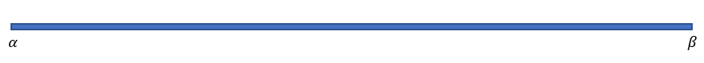
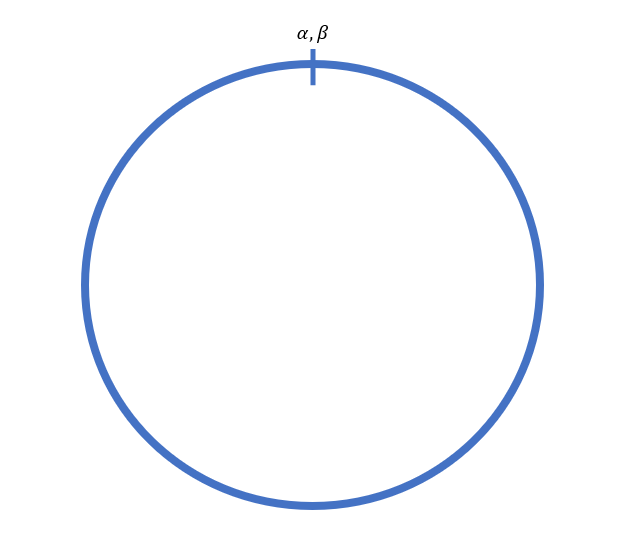
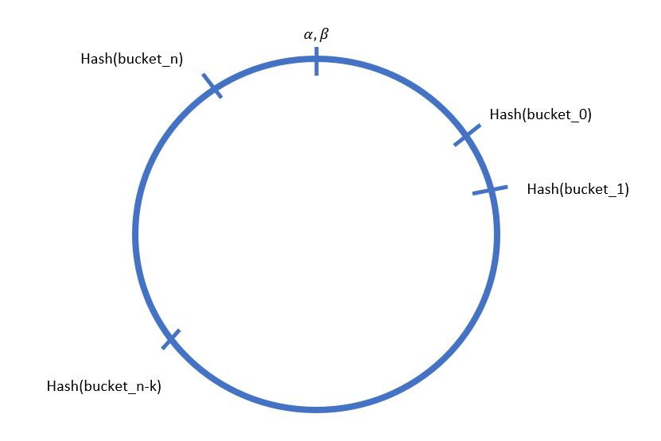
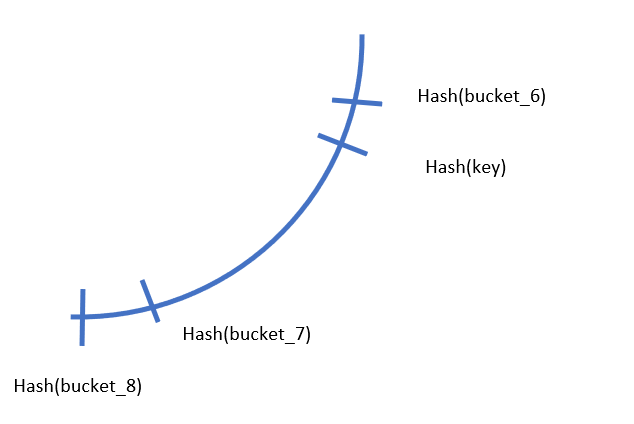
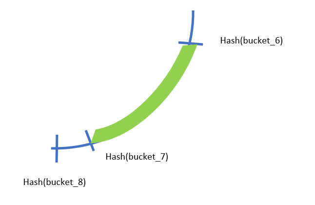
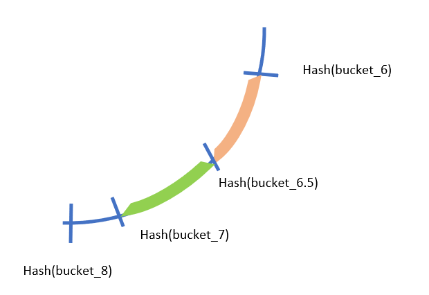
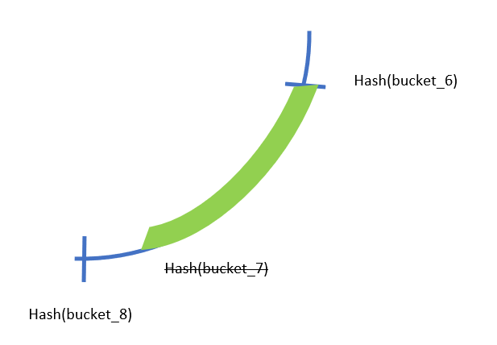
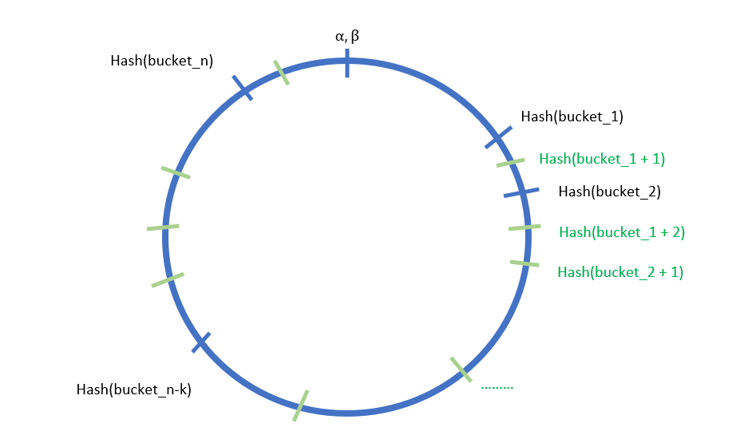

## Consistent Hashing

**Consistent hashing** is an algorithm designed to efficiently re-distribute keys among buckets when the  number of buckets changes.

### Application

Consistent hashing can be used in distributed caching where we want to balanced out the load of cache servers. The keys in this case are web servers that fetch caches, and the buckets are cache servers.

### Why do we need consistent hashing?

Suppose there are $n$ buckets and $k$ keys. How can we evenly distribute the keys to the buckets such that the loads on each cache server are balanced? A simple attempt can be to utilize the following functions:
$$
bucketIndex=hash(key) \mod n
$$
which works if we have $(i)$ an uniformly distributed hash function $hash$ and $n$ **never changes**.

$(i)$ If the hash function is not uniformly distributed, certain output would be more frequent than the others, resulting in unbalanced loads across buckets. Nonetheless, selecting an uniformly distributed hashing function is easy, to name a few, there are CRC32, MD5, and SHA-1.

$(ii)$ In real life, $n$, the number of buckets (e.g. cache servers), is often altering due to maintenance, addition, upgrade, or simply disasters, etc. 

When $n$ increase, we hope to remap the keys so loads are more balanced out.

+ Need to remap up to $k-n \in \mathcal{O}(k)$ keys when $n$ increase by $1$.

When $n$ decrease, we need to remap the keys assigned. 

- We need to redistribute up to $k-1 \in \mathcal{O}(k)$ keys when $n$ decrease by $1$.

The worst case of re-distributing almost all keys is a nightmare, and **consistent hashing** comes to the rescue.

### Consistent Hashing

Since our $hash$ function is uniformly distributed, $hash$'s range is the interval from $\alpha$ to $\beta$:

if we connect the beginning and end of the line, we get a circle:

 the circle is called **hash ring**.

### Hash Ring

We can hash the bucket indices to the ring,

The subtle idea now is to distribute the keys to the $bucket\_k$ to according to the closest upcoming $hash(bucket\_k)$ from $hash(key)$, namely we want $k \in [0, n]$ such that

$hash(bucket\_k-1) < hash(key) < hash(bucket\_k)$.

For example, if we have $hash(bucket\_6) <hash(key) < hash(bucket\_7)$, Then we should distribute $key$ to $bucket\_7$.

what this implies is that for all $key\_i$ satisfying $hash(bucket\_k-1)< hash(key\_i) < hash(bucket\_k)$, we distribute $key\_i$ to $bucket\_k$. In the image representation, every key hashed to the green curve would be distributed to $bucket\_7$.

How does hash ring improve efficiency when $n$, the number of buckets, changes?

When $n$ increases, we only need to remap up to $k/n \in \mathcal{O}(\alpha) \subseteq \mathcal{O(1)}$  keys, where $\alpha = k/n$, the load factor, can be thought of as a constant. In the image representation, we see the green part is still distributed to $bucket\_7$, and only the orange part needs to be redistributed to the new $bucket\_6.5$.

Similarly, when $n$ decreases, up to $k/n \in \mathcal{O}(\alpha) \subseteq \mathcal{O(1)}$ keys needs remapping. In the image representation, if we take out $bucket\_7$, only the green part needs to be redistributed to $bucket\_8$.

There is still a problem that needs consideration. What if the keys are non-uniformly distributed, meaning they might be clustered together? After all, if the keys are clustered together, we can still overload and underload some buckets. Virtual nodes are proposed to solve this problem.

### Virtual Nodes

The idea is to make buckets distributed dense enough so that even keys are clustered together, we would end up with a balanced load. To do this, we can introduce virtual nodes (virtual buckets) into the hash ring. 

In the hash ring, each virtual node is a representation of an actual bucket, and a bucket can have many representation. Let the number of virtual nodes be $2$. For $bucket\_i$, the virtual nodes are represented by $hash(bucket\_i + 1)$ and $hash(bucket\_i + 2)$. Then we could have:
$$
\begin{aligned}
hash(bucket\_1) 
&<  hash(bucket\_1+1)\\
&< hash(bucket\_2) < hash(bucket\_1+2) < hash(bucket\_2+1)\\
&< hash(bucket\_3) \\
&< hash(bucket\_2+2) < hash(bucket\_3+1) \\
&< hash(bucket\_4)<\dots
\end{aligned}
$$

the actual arrangement of $hash(bucket\_i + k)$ depends on the hash function and parameters, but it can be seem that that buckets appears denser uniformly throughout the hash ring.

The addition of virtual nodes does not affect the number of keys that needs to be remapped:

- When $n$ increases, the new bucket receives remapped keys from other buckets evenly due to uniform distribution of virtual nodes. Therefore the number of keys that needs remapped remains $\mathcal{O(\alpha)}$.

- When $n$ decreases, due to uniform distribution of the virtual nodes, the keys are remapped to other buckets evenly. Therefore the number of keys that needs remapped remains $\mathcal{O(\alpha)}$.

### Further Reading

- [Consistent Hashing and Random Trees: Distributed Caching Protocols for Relieving Hot Spots on the World Wide Web](https://www.akamai.com/us/en/multimedia/documents/technical-publication/consistent-hashing-and-random-trees-distributed-caching-protocols-for-relieving-hot-spots-on-the-world-wide-web-technical-publication.pdf)